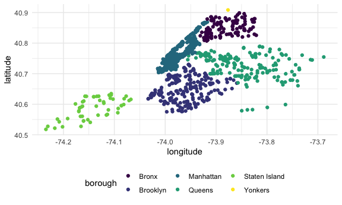

Flu Vaccination Sites
================
Adam Whalen
11/20/2020

## Data Description

This data set contains information about the locations in NYC where
individuals can get a flu shot.

``` r
flu_vax = 
  GET("https://data.cityofnewyork.us/resource/w9ei-idxz.csv") %>% 
  content("parsed")
```

    ## Parsed with column specification:
    ## cols(
    ##   .default = col_character(),
    ##   objectid = col_double(),
    ##   a = col_double(),
    ##   latitude = col_double(),
    ##   longitude = col_double(),
    ##   zip_code = col_double(),
    ##   monday = col_logical(),
    ##   tuesday = col_logical(),
    ##   wednesday = col_logical(),
    ##   thursday = col_logical(),
    ##   friday = col_logical(),
    ##   saturday = col_logical(),
    ##   sunday = col_logical()
    ## )

    ## See spec(...) for full column specifications.

``` r
view(flu_vax)
object.size(flu_vax)
```

    ## 420272 bytes

Tidy the set

``` r
flu_vax_tidy = 
  flu_vax %>% 
  select(objectid, facility_name, walk_in, insurance, children, borough, zip_code, latitude, longitude) %>% 
  mutate(borough = str_to_title(borough))
```

Graph it up

``` r
vax_map = 
  flu_vax_tidy %>% 
  ggplot(aes(x = longitude, y = latitude, color = borough)) +
  geom_point()

vax_map
```



Rad.
