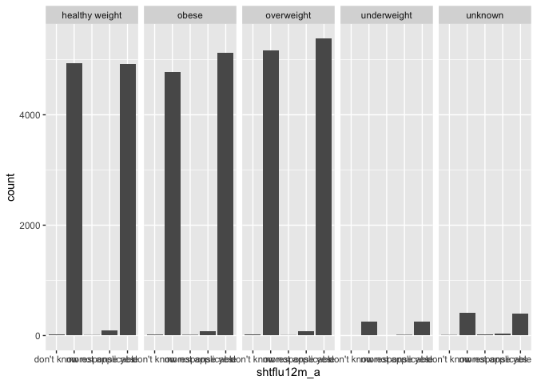
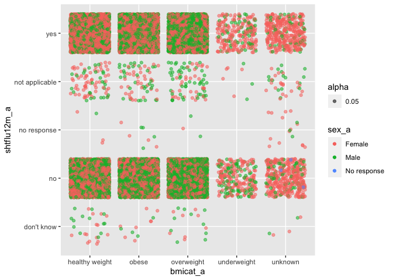
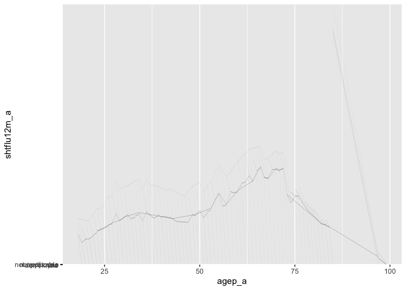
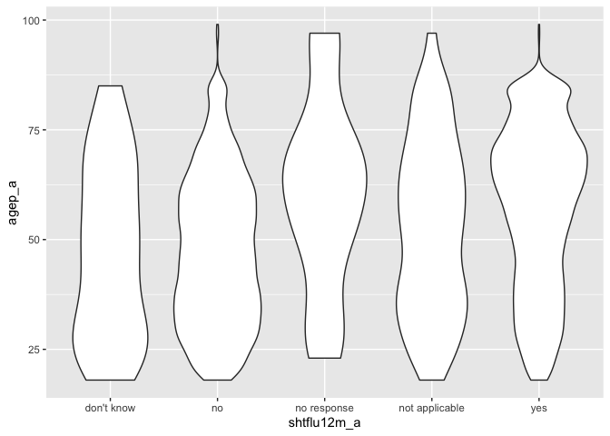

National Health Survey
================
Ronae McLin
11/16/2020

## importing and tidying the National Health Survey data

***focus is on flu vaccines***

``` r
library(tidyverse)
```

    ## ── Attaching packages ─────────────────────────────────────── tidyverse 1.3.0 ──

    ## ✓ ggplot2 3.3.2     ✓ purrr   0.3.4
    ## ✓ tibble  3.0.1     ✓ dplyr   1.0.0
    ## ✓ tidyr   1.1.0     ✓ stringr 1.4.0
    ## ✓ readr   1.3.1     ✓ forcats 0.5.0

    ## ── Conflicts ────────────────────────────────────────── tidyverse_conflicts() ──
    ## x dplyr::filter() masks stats::filter()
    ## x dplyr::lag()    masks stats::lag()

not really sure what this data set contains. need to look into this more

adult sample for 2019

\*\* there is ALOT of information and variables within this dataset. we
can take this into many different directions \*\*

``` r
  adult_df = 
  read_csv("adult19.csv")
```

    ## Parsed with column specification:
    ## cols(
    ##   .default = col_double(),
    ##   OGFLG_A = col_logical(),
    ##   OPFLG_A = col_logical(),
    ##   CHFLG_A = col_logical(),
    ##   PRPLCOV2_C_A = col_logical(),
    ##   STOMAAGETC_A = col_logical(),
    ##   LARYNAGETC_A = col_logical(),
    ##   GALLBAGETC_A = col_logical(),
    ##   BRAINAGETC_A = col_logical(),
    ##   BLOODAGETC_A = col_logical(),
    ##   SHINGWHEN_A = col_logical(),
    ##   OGHDHP_A = col_logical(),
    ##   OPHDHP_A = col_logical(),
    ##   CHHDHP_A = col_logical(),
    ##   HHX = col_character()
    ## )

    ## See spec(...) for full column specifications.

    ## Warning: 107 parsing failures.
    ##  row          col           expected actual          file
    ## 1348 BLOODAGETC_A 1/0/T/F/TRUE/FALSE     45 'adult19.csv'
    ## 1375 BRAINAGETC_A 1/0/T/F/TRUE/FALSE     16 'adult19.csv'
    ## 1790 BLOODAGETC_A 1/0/T/F/TRUE/FALSE     62 'adult19.csv'
    ## 1924 OPHDHP_A     1/0/T/F/TRUE/FALSE     2  'adult19.csv'
    ## 3306 BLOODAGETC_A 1/0/T/F/TRUE/FALSE     58 'adult19.csv'
    ## .... ............ .................. ...... .............
    ## See problems(...) for more details.

  - was SA pregnant last flu season?
  - flu vaccine
  - month of last flu vaccine,
  - year of last flu vaccine
  - was flu shot before or during pregnancy?
  - earlier pregnancy and flu vaccine
  - etc….

there is an interesting category pertaining to mobility, this could be
helpful if we end up discussing accessbility to loaction to obtain a flu
shot

there is also interesting category of variables pertaining to insurance
plans and coverage.

interesting category of variables pertaining to utilization of
healthcare services, outside of the scope of only flu vaccines.

``` r
flu_adult_df =
  adult_df %>% 
  janitor::clean_names() %>% 
  select(
    srvy_yr,agep_a, age65, sex_a, educ_a,hisp_a, hispallp_a, hisdetp_a,phstat_a,bmicat_a, notcov_a, cover_a, usualpl_a, usplkind_a,  pregfluyr_a, shtflu12m_a, shtflum_a, shtfluy_a, flupreg2_a
  ) %>% 
  mutate(
      age65 = case_when(
      age65 == "1" ~ "Less than 65",
      age65 == "2" ~ "65 or older",
      age65 == "7" ~ "No response",
      age65 == "8" ~ "Not applicable",
      age65 == "9" ~ "Don't know"),
      
      sex_a = case_when(
      sex_a == "1" ~ "Male",
      sex_a == "2" ~ "Female",
      sex_a == "7" ~ "No response",
      sex_a == "8" ~ "Not applicable",
      sex_a == "9" ~ "Don't know"),
      
      educ_a = case_when(
      educ_a == "00" ~ "never attended",
      educ_a == "01" ~ "Grades 1-11",
      educ_a == "02" ~ "12th grade, no dipolma",
      educ_a == "03" ~ "GED",
      educ_a == "04" ~ "HS graduate",
      educ_a == "05" ~ "College, no degree",
      educ_a == "06" ~ "Associate degree-tech",
      educ_a == "07" ~ "Associate degree-aca",
      educ_a == "08" ~ "Bachelor's degree",
      educ_a == "09" ~ "Master's degree",
      educ_a == "10" ~ "Professional school",
      educ_a == "11" ~ "Doctoral degree",
      educ_a == "97" ~ "No response",
      educ_a == "98" ~ "Not applicable",
      educ_a == "99" ~ "Don't know"),
      
      hisp_a = case_when(
      hisp_a == "1" ~ "Yes",
      hisp_a == "2" ~ "No",
     hisp_a == "7" ~ "No response",
     hisp_a == "8" ~ "Not applicable",
      hisp_a == "9" ~ "Don't know"),
     
     hispallp_a = case_when(
      hispallp_a == "01" ~ "hispanic",
      hispallp_a == "02" ~ "NH white",
     hispallp_a == "03" ~ "NH black", 
     hispallp_a == "04" ~ "NH asian",
     hispallp_a == "05" ~ "NH AIAN",
      hispallp_a == "06" ~ "NH AIAN and other",
      hispallp_a == "07" ~ "multiple races",
       hispallp_a == "97" ~ "No response",
     hispallp_a == "98" ~ "Not applicable",
      hispallp_a == "99" ~ "Don't know"),
     
      hisdetp_a = case_when(
      hisdetp_a == "1" ~ "hispanic mexican",
      hisdetp_a == "02" ~ "hispanic all others",
     hisdetp_a == "03" ~ "Not hispanic", 
        hisdetp_a == "7" ~ "No response",
     hisdetp_a == "8" ~ "Not applicable",
      hisdetp_a == "9" ~ "Don't know"),
     
     phstat_a =  case_when(
      phstat_a == "01" ~ "excellent",
      phstat_a == "02" ~ "very good",
      phstat_a == "03" ~ "good",
      phstat_a == "04" ~ "fair",
      phstat_a == "05" ~ "poor",
      phstat_a == "07" ~ "no response",
      phstat_a == "08" ~ "not applicable",
      phstat_a == "09" ~ "Don't know"),
     
      bmicat_a =  case_when(
      bmicat_a == "1" ~ "underweight",
      bmicat_a == "2" ~ "healthy weight",
       bmicat_a == "3" ~ "overweight",
       bmicat_a == "4" ~ "obese",
       bmicat_a == "9" ~ "unknown"),
     
  notcov_a = case_when(
    notcov_a == "1" ~ "not covered",
    notcov_a == "2" ~ "covered",
    notcov_a == "7" ~ "no response",
    notcov_a == "8" ~ "not applicable",
    notcov_a == "9" ~ "don't know"),
  
    cover_a = case_when(
      cover_a == "1" ~ "private",
      cover_a == "2" ~ "medicaid/other public",
      cover_a == "3" ~ "other",
      cover_a == "4" ~ "uninsured",
      cover_a == "5" ~ "don't know"),
  
  usplkind_a = case_when(
    usplkind_a == "1" ~ "Doctor office/health center",
    usplkind_a == "2" ~ "Urgent care/clinic in store",
    usplkind_a == "3" ~ "emergency room",
    usplkind_a == "4" ~ "VA center ",
    usplkind_a == "5" ~ "other",
    usplkind_a == "6" ~ "varies",
    usplkind_a == "8" ~ "not applicable",
    usplkind_a == "9" ~ "don't know"),
  
  pregfluyr_a = case_when(
  pregfluyr_a == "1" ~ "yes",
  pregfluyr_a == "2" ~ "no",
  pregfluyr_a == "7" ~ "no response",
  pregfluyr_a == "8" ~ "not applicable",
  pregfluyr_a == "9" ~ "don't know"),
  
  shtflu12m_a  = case_when(
  shtflu12m_a == "1" ~ "yes",
  shtflu12m_a == "2" ~ "no",
  shtflu12m_a == "7" ~ "no response",
  shtflu12m_a == "8" ~ "not applicable",
  shtflu12m_a == "9" ~ "don't know"),
  
    shtflum_a = case_when(
      shtflum_a == "01" ~ "January ",
      shtflum_a == "02" ~ "February",
      shtflum_a == "03" ~ "March",
      shtflum_a == "04" ~ "April",
      shtflum_a == "05" ~ "May",
      shtflum_a == "06" ~ "June ",
      shtflum_a == "07" ~ "July",
      shtflum_a == "08" ~ "August",
      shtflum_a == "09" ~ "September",
      shtflum_a == "10" ~ "October",
      shtflum_a == "11" ~ "November",
      shtflum_a == "12" ~ "December",
      shtflum_a == "97" ~ "No response",
      shtflum_a == "98" ~ "Not applicable",
      shtflum_a == "99" ~ "Don't know"),
  
   shtfluy_a = case_when(
    shtfluy_a == "9997" ~ "no response",
    shtfluy_a == "9998" ~ "not applicable",
    shtfluy_a == "9999" ~ "don't know"),
  
  flupreg2_a = case_when(
    flupreg2_a == "1" ~ "before pregnancy",
    flupreg2_a == "2" ~ "during pregnancy",
    flupreg2_a == "3" ~ "after pregnancy",
    flupreg2_a == "7" ~ "no response",
    flupreg2_a == "8" ~ "not applicable",
    flupreg2_a == "9" ~ "don't know"),

usualpl_a = case_when(
    usualpl_a == "1" ~ "yes",
    usualpl_a == "2" ~ "no",
    usualpl_a == "3" ~ "more than one place",
    usualpl_a == "7" ~ "no response",
    usualpl_a == "8" ~ "not applicable",
    usualpl_a == "9" ~ "don't know"))
```

plots bebe

wow that’s alot of people who haven’t gotten a flu shot

``` r
flu_adult_df %>% 
  ggplot(aes( x = shtflu12m_a)) + geom_bar() + facet_grid(.~bmicat_a)
```

<!-- -->

let’s compare

just realized i didn’t import any continous variables

``` r
flu_adult_df %>% 
  ggplot(aes(x = bmicat_a, y = shtflu12m_a, color = sex_a, alpha = .05)) + geom_jitter()
```

<!-- -->

Seems like more men don’t get a flu shot

wow this looks terrible

``` r
flu_adult_df %>% 
  ggplot(aes(x = agep_a, y = shtflu12m_a)) + geom_area()
```

<!-- -->

can make this interactive, then add different levels with other
variables The entire page can be the background information/demographics
of the respondents

``` r
flu_adult_df %>% 
  ggplot(aes(y = agep_a, x = shtflu12m_a)) + geom_violin()
```

<!-- -->

im curious about the Nos and the Yes
